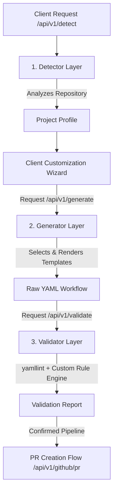

# Project Architecture & Technical Report
## CI/CD Workflow Generator

This report documents the architectural design, implementation details, validation logic, system limitations, and future perspectives of the CI/CD Workflow Generator.

---

## 1. System Architecture

The CI/CD Workflow Generator is structured as a decoupled client-server application. The backend is designed as a three-layer processing pipeline (Detector, Generator, and Validator) built on top of FastAPI.

### 3-Layer Backend Pipeline

The application processes requests sequentially through three distinct layers, ensuring separation of concerns and high modularity:

1. **Detector Layer (`app/detector/`)**:
   - **Responsibility**: Inspects remote GitHub repositories to automatically identify the project profile.
   - **Mechanism**: Parses structural files (like `requirements.txt`, `package.json`, `pom.xml`, and `build.gradle`) via specialized language parsers without fully cloning or persisting code on disk. It constructs a standardized `DetectedStack` model containing identified runtime versions, test frameworks, linters, package managers, and presence of a Dockerfile.

2. **Generator Layer (`app/generator/`)**:
   - **Responsibility**: Converts the customized project profile (confirmed by the user in the wizard) into a concrete GitHub Actions workflow YAML.
   - **Mechanism**: The `pipeline_builder` matches the target language, frameworks, and selected checks against pre-registered Jinja2 templates, compiling them into a final workflow definition.

3. **Validator Layer (`app/validator/`)**:
   - **Responsibility**: Performs syntax checks and enforces best-practice pipeline design rules.
   - **Mechanism**: Evaluates the generated workflow using a dual approach: a standard YAML linter (`yamllint`) and a custom Python rule engine (`rule_engine`).

---

### Template System Design Decisions

The template engine is built entirely on file-based Jinja2 templates rather than a database-driven approach for the following reasons:

- **Git-Native Versioning**: Workflows are code. Storing templates as `.yml.j2` files in the repository ensures that modifications to templates go through the same code review, pull request, and versioning pipelines as the application itself.
- **File System Performance & Caching**: Loading templates directly from the filesystem via Jinja2's `FileSystemLoader` eliminates database round-trip latency. It enables fast compilation and easy local testing of snapshots.
- **Compositionality**: Jinja2 supports template composition (``), allowing common fragments (such as caching strategies or environment setups) to be reused across different languages and framework templates without duplication.

---

## 2. Validation Design & Rules

To ensure both syntactic correctness and compliance with structural best practices, the Validator Layer separates validation into two stages:

1. **Syntactic Validation (`yamllint`)**: Verifies that the produced file is valid YAML, conforming to correct indentation, spacing, and serialization rules.
2. **Semantic / Structural Validation (Custom Rule Engine)**: Evaluates the logical soundness of the pipeline. It parses the YAML into a Python dictionary and runs isolated rule functions.

### The 6 Custom Pipeline Rules

The suite enforces 6 custom rules, each targetting a specific risk or sub-optimal configuration in CI pipelines:

| Rule ID | Severity | Purpose / Consequence |
|---|---|---|
| `tests_before_deploy` | **ERROR** | **Deploy job must declare `needs: [test]`**. Ensures that code is never deployed to production unless the test job has run successfully. Prevents shipping broken releases. |
| `no_hardcoded_secrets` | **ERROR** | **No hardcoded secrets allowed**. Scans the YAML structure for plain-text assignments to keys like `password`, `token`, or `secret`. Prevents accidental leaks of credentials in version control, forcing the use of GitHub Secrets (`${{ secrets.X }}`). |
| `triggers_present` | **ERROR** | **At least one trigger event must be present under `on:`**. A workflow without a trigger (such as `push` or `pull_request`) will never execute automatically, rendering the pipeline useless. |
| `test_job_exists` | **WARNING** | **No job named `test` or `run-tests` was found**. Warns the developer if the pipeline has no explicit test suite execution. Pipelines without tests undermine the core goal of CI/CD. |
| `cache_missing` | **WARNING** | **No dependency caching mechanism found**. Encourages developers to enable package caching (e.g., caching `~/.npm` or `~/.cache/pip`). Caching significantly speeds up pipeline execution and saves runner minutes. |
| `no_timeout` | **WARNING** | **Jobs have no `timeout-minutes` set**. Prevents jobs from running indefinitely (up to GitHub's default 6-hour limit) if a test hangs or a build gets stuck, which would waste billing minutes. |

---

## 3. System Limitations

As an MVP, the CI/CD Workflow Generator has the following design boundaries:

- **Authentication Scope for Private Repositories**: The tool relies on PyGithub with public access or OAuth tokens. While public repositories can be analyzed anonymously, private repositories cannot be accessed without the user explicit OAuth login.
- **Single-Stack Language Assumption**: The detector assumes a single predominant stack per repository (e.g., only Python or Node or Java). It is not designed to recognize or generate complex pipelines for multi-language polyglot codebases or monorepos.
- **GitHub Actions Exclusive**: The generator is coupled to GitHub Actions. It cannot output config formats for alternative CI/CD providers like GitLab CI, CircleCI, or Jenkins.
- **Static Template Engine**: The workflow is compiled from pre-written templates. It does not support arbitrary matrix strategies, advanced runner OS choices, or highly customized multi-step build environments that fall outside our template registry.
- **Basic Simulation Deployment Only**: The deploy step in the templates is a simulation stub (`echo "Deploying..."`). Setting up real deployments requires cloud credentials and provider-specific CLI configurations which cannot be fully automated statically.

---

## 4. Perspectives & Future Extensions

To evolve the CI/CD Workflow Generator into a production-grade enterprise platform, the following extensions are planned:

1. **GitLab CI & CI/CD Cross-Compilation**:
   - Introduce target engine configurations. Using the same project profile, compile the pipeline to GitLab CI `.gitlab-ci.yml` or Bitbucket Pipelines configurations.
2. **YAML Auto-Repair Mode**:
   - Implement an automated remediation engine. If a rule fails (e.g., `no_timeout` is triggered), the system should offer a "Fix for me" option to automatically inject `timeout-minutes: 30` or `needs: [test]` into the YAML AST.
3. **Enterprise Compliance Policy Engine (SAST/SBOM)**:
   - Expand the custom rule validation to enforce organization-wide compliance, such as mandatory Trivy/SonarQube security scans, license audits, or Software Bill of Materials (SBOM) generation prior to release.
4. **AI-Assisted Custom Step Suggestions**:
   - Integrate an LLM-assisted assistant that reads custom scripts from the target repository and suggests custom GitHub Actions from the marketplace (e.g., detecting a Firebase config file and suggesting the Firebase deploy action).
